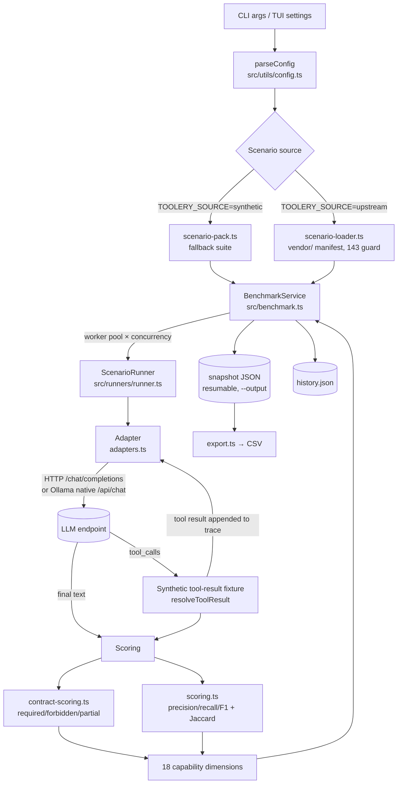
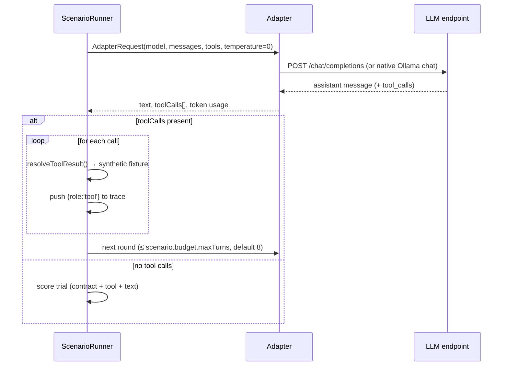

# Architecture — Toolery-TS

> Primary reader: AI developer agent. Verified against code @ main `970eb29` (v0.4.1).

## 1. Tech Stack

| Layer | Choice | Notes |
|---|---|---|
| Language | TypeScript 5.9, `strict: true` | ESM only, `module: NodeNext` |
| Runtime | Node.js >= 20 | Uses native `fetch`, `node:test`, `performance.now()` |
| CLI | meow v14 | Subcommands dispatched in `src/cli.tsx` |
| TUI | Ink 7 + React 19 + `@kud/ink-ui` | Terminal dashboard; requires TTY |
| Ollama transport | `@nemesis-oss/ollama-sdk` v1.8 | Author's own SDK (maintenance risk — see memory.md); upgraded 1.3→1.8 with the `tool_name` wire fix (D-12) |
| YAML | `yaml` v2 | Upstream scenario parsing |
| Tests | `node:test` + `tsx` loader | 25 tests, no framework deps |
| Build | `tsc` → `dist/` | `declaration`, `declarationMap`, `sourceMap` |

## 2. Folder Structure

```text
toolery-ts/
├── src/
│   ├── cli.tsx                 # meow CLI entry: run|tui|profiles|scenarios|probe|export
│   ├── app.tsx                 # Ink TUI: 9 tabs, presets, probe, settings
│   ├── benchmark.ts            # BenchmarkService: concurrency, resume, snapshot persist
│   ├── scenarios.ts            # Source switch (synthetic | upstream) — reads TOOLERY_SOURCE
│   ├── scenario-pack.ts        # Deterministic synthetic fallback scenarios
│   ├── scenario-loader.ts      # Upstream YAML → Scenario conversion (143-count guard)
│   ├── runners/
│   │   ├── runner.ts           # ScenarioRunner: multi-turn tool loop + scoring orchestration
│   │   ├── adapters.ts         # OpenAICompatible/Raw/Cloud/Ollama/Hermes/Mock adapters
│   │   └── mock-adapter.ts     # ScriptedMockAdapter (scenario-aware, used when adapter=mock)
│   ├── utils/
│   │   ├── config.ts           # parseConfig: flag/env validation (single source of defaults)
│   │   ├── scoring.ts          # Tool-call precision/recall/F1, Jaccard text similarity, aggregation
│   │   └── contract-scoring.ts # required/forbidden/partial DSL evaluation
│   ├── statistics.ts           # mean/stdev, tier weights, McNemar (exact binomial), time decay
│   ├── rankings.ts             # Tier-weighted ranking + per-dimension rows
│   ├── compare.ts              # Paired run comparison via McNemar
│   ├── probe.ts                # Endpoint health check (Ollama /api/tags or OpenAI /v1/models)
│   ├── export.ts               # JSON snapshot → CSV; summary formatter
│   ├── history.ts              # Local JSON run history (.toolery/history.json)
│   ├── profiles.ts             # 8 reporting weight profiles
│   ├── dimensions.ts           # 18 capability dimension definitions
│   ├── tool-catalog.ts         # 18 fixture tool definitions (weather, crypto, git_status…)
│   ├── perf.ts                 # Optional llama-benchy throughput wrapper (unvalidated)
│   └── index.ts                # Public API re-exports
├── tests/                      # 4 test files: scoring, contract-scoring, runner, scenarios
├── scripts/sync-upstream-scenarios.mjs  # Fetches 143 YAMLs from pinned upstream commit → vendor/
├── vendor/toolery-upstream/    # NOT committed (only NOTICE.md). Populated by sync script
├── website/                    # VitePress docs site (separate package.json)
└── dist/                       # Build output (npm files whitelist)
```

## 3. Data Flow

### 3.1 End-to-end run



### 3.2 Multi-turn scenario loop (per trial)



**Loop bound**: `maxRounds = scenario.budget?.maxTurns ?? max(2, expectedToolCalls.length + 2)`.

## 4. Key Modules & Contracts

### 4.1 Adapter contract (`src/runners/adapters.ts`)

Every provider implements `LlmAdapter`:

```ts
interface LlmAdapter {
  readonly kind: AdapterKind; // 'ollama' | 'openai-compatible' | 'raw' | 'cloud' | 'hermes' | 'mock'
  complete(request: AdapterRequest): Promise<AdapterResponse>;
}
```

- `OpenAICompatibleAdapter` — base HTTP transport (fetch + AbortController timeout); `RawAdapter` and `CloudAdapter` subclass it. Cloud requires `TOOLERY_API_KEY` at construction.
- `OllamaAdapter` — native Ollama API via SDK; strips trailing `/v1` from base URL.
- `HermesAdapter` — stub, always throws (external MCP bridge required).
- Selection happens in `ScenarioRunner` constructor via `config.adapter` string switch.

### 4.2 BenchmarkService (`src/benchmark.ts`)

Worker-pool concurrency over a de-duplicated queue; `--resume` reloads a snapshot and **skips completed scenarioIds** after verifying `benchmarkVersion`, `model`, `tier`, `source` all match. Persists the full snapshot after every completed scenario (crash-safe).

### 4.3 Scenario source switch (`src/scenarios.ts`)

`process.env.TOOLERY_SOURCE === 'upstream'` selects the upstream manifest; otherwise the built-in synthetic pack. The CLI `--source` flag sets this env var before loading. **Never silently substitutes** one for the other — upstream load throws if the 143-count manifest is absent.

### 4.4 Upstream sync (`scripts/sync-upstream-scenarios.mjs`)

Fetches the Git tree of `karolpalys/toolery@36c8c0c…`, filters `scenarios/{easy,medium,hard,very_hard}/*.yaml`, enforces exactly 143 files, writes raw YAML + SHA-256 into `vendor/toolery-upstream/` plus `manifest.json` (path, hash, parsed scenario). Pinned to one immutable commit — scenario drift is impossible without changing the pin.

### 4.5 Config (`src/utils/config.ts`)

Single source of truth for defaults and validation. Flag → env fallback chain: `flags.X ?? process.env.TOOLERY_X ?? default`. Validation ranges: trials 1–100, concurrency 1–32, timeout ≥ 100ms. Default adapter `ollama` (native, `http://localhost:11434`); OpenAI-compatible default `http://localhost:11434/v1`.

## 5. Process / Publishing Model

- `files` whitelist in package.json: `dist`, `README.md`, `LICENSE`, `BENCHMARK.md`, `PARITY.md`, `vendor/toolery-upstream` (the synced suite ships in the tarball — but only if `sync:upstream` ran before `npm publish`).
- Public programmatic API: `dist/index.js` (`main`) re-exports types, scenarios, adapters, runner, scoring, statistics.
- CI: `.github/workflows/ci.yml` (typecheck → lint → test → build → pack:check) and `docs.yml` (VitePress → GitHub Pages). ⚠️ Both currently have a corrupted trigger (`branches: ain]`) — see tasks.md P0-2.
